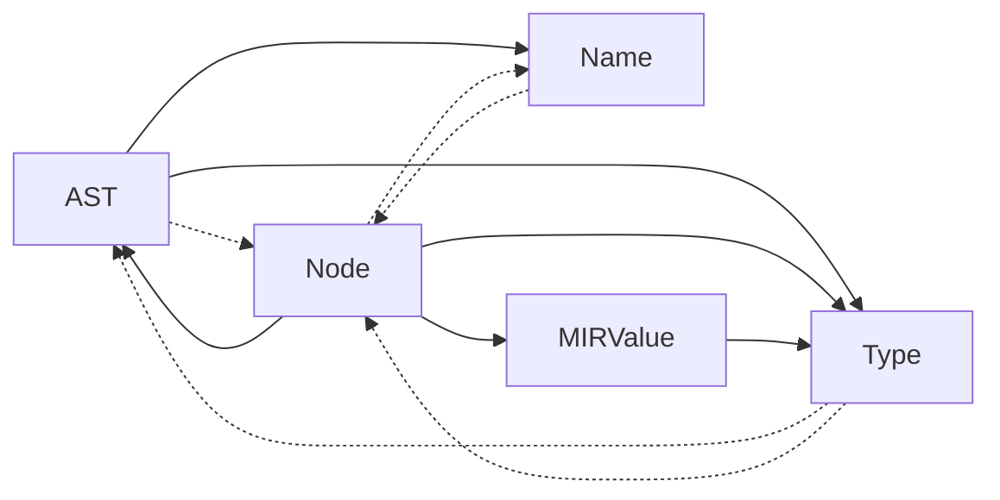

# Reference Ownership Diagram

> [!WARNING]
> This diagram is subject to change as the compiler evolves.

Below is the *reference ownership diagram* for the compiler context. It shows the relationships between the various objects in the compiler context and how they are connected to each other.

This diagram is written using [Mermaid](https://mermaid.ai/open-source/) syntax. 
If you do not see the rendered graph below, you can use the [Mermaid Live Editor](https://mermaid.ai/live/edit) online for free to view and edit the diagram.
Up-to-date versions of VS Code support Mermaid diagram rendering natively.

- Shapes represent the different types of objects in the compiler context.
  - "AST" refers to the abstract syntax tree and includes the classes `Stmt`, `Expr`, and `Annotation`.
  - "Node" refers to the `Node` class, which represent symbol nodes in the symbol tree.
- Solid arrows represent strong references, i.e., `std::shared_ptr`, which contribute to the reference count of the object being referenced.
- Dashed arrows represent weak references, i.e., `std::weak_ptr`, which do not contribute to the reference count of the object being referenced.

This graph must never contain cycles of strong references, as this would create circular references and prevent the objects involved from being deleted.

When extending or modifying the compiler context, it is important to consider how the new or modified objects will fit into this diagram and how they will affect the ownership relationships between objects.

- If an arrow already exists between two objects, prefer using the corresponding reference type (strong or weak) to maintain consistency and avoid introducing circular references.
- If an arrow does not exist between two objects, consider if adding a strong reference would create a cycle, and if so, use a weak reference instead.

## Context

In Nico, the *compiler context* is a vast network of interconnected objects used to represent the code being compiled and all the information needed to generate the final output.

To avoid using raw pointers and manual memory management, we use smart pointers to manage the ownership and lifetime of these objects. This ensures that objects are automatically deleted when they are no longer needed, preventing memory leaks and dangling pointers.
We make extensive use of `std::shared_ptr`, which uses reference counting to manage the lifetime of objects. This means that when an object is no longer needed, it is automatically deleted when there are no more references to it.

Using reference-counted smart pointers comes with its own challenges, particularly when it comes to circular references. A circular reference occurs when two or more objects reference each other, creating a cycle that prevents the reference count from ever reaching zero. This can lead to memory leaks, as the objects involved in the cycle will never be deleted.

We must take care to avoid circular references in our design, and we must be aware of the potential for circular references when working with reference-counted smart pointers.
